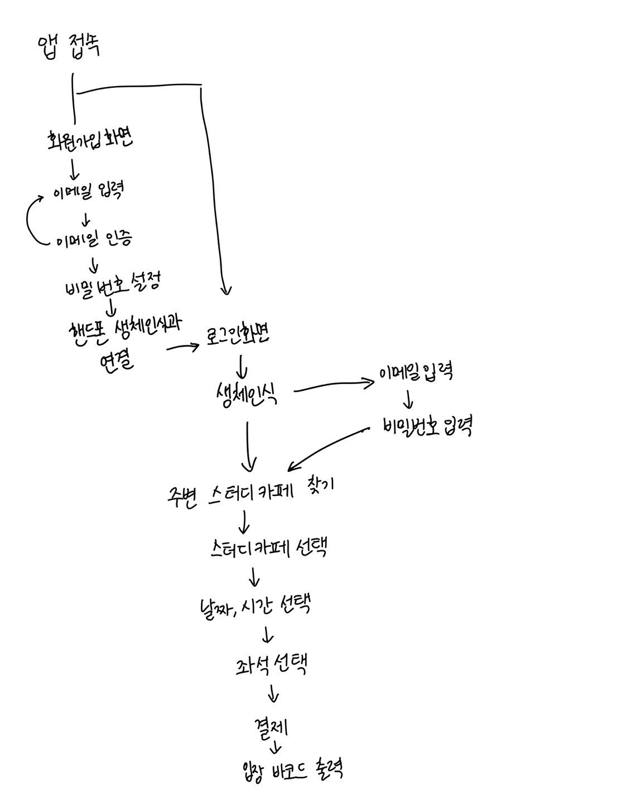

# 프로젝트 명
### 스터디카페 자리 쇼핑하기

# 프로젝트 설명
중앙대학교 예술공학부 오픈소스프로그래밍 수업에서 중간대체과제로 하는 git, git hub를 이용한 프로젝트이다. 
### 배달의 민족에서 음식을 사서 먹듯 스터디카페의 좌석을 예약하는 프로젝트이다. 이는 생체인식을 기반으로 로그인을 한 뒤, 사용자의 위치 주변에 있는 스터디카페들을 찾아준다. 그 중 하나를 골라 좌석과 시간을 선택하여 결제한다.

# 팀원 소개
### 팀장 : 박지연 (@Jy3617)
#### 회의 주도(총괄), 아이디어 스케치, 오픈소스 프로그램 서치, Readme 작성, 코드 작성 및 수정
### 팀원 : 서현서 (@mariposa2023)
#### 아이디어 스케치, 오픈소스 프로그램 서치, Readme 작성, 코드 작성 및 수정, 보고서 작성

# Flow chart



# 참고한 오픈소스 프로젝트

[facial_rec_live_codeSite](https://github.com/x4nth055/pythoncode-tutorials/blob/64cd00815fcf3ee91a5b28b8bf427129d0aeea8b/machine-learning/facial-recognition-system/facial_rec_live_camera.py, "Move to facial_rec_live_code's Site")

```
source code
...
# Initialize empty lists to store images and people's names.
known_faces = []
face_labels = []

# Get a list of all images in the TrainingImages directory.
image_files = os.listdir("TrainingImages")

# Loop through the images in the directory.
for image_name in image_files:
    # Read each image and add it to the known_faces list.
    current_image = cv2.imread(f'TrainingImages/{image_name}')
    known_faces.append(current_image)

    # Extract the person's name by removing the file extension and add it to the face_labels list.
    face_labels.append(os.path.splitext(image_name)[0])
...
```


```
...
# Function to start the Facial recognition program.
def start_recognition_program():
    # Open a webcam for capturing video. If you are using your computer's webcam, change 1 to 0.
    # If using an external webcam, leave it as 1.
    video_capture = cv2.VideoCapture(1)

    while True:
        # Read a frame from the webcam.
        frame = video_capture.read()

        # Check if the frame is not None (indicating a successful frame capture).
        if frame is not None:
...
```

[Reservation_codeSite](https://github.com/eee0930/movie_reservation_SPA/blob/main/%EB%AC%B8%EC%A0%9C%202%EB%B2%88.md, "Move to facial_rec_live_code's Site")
